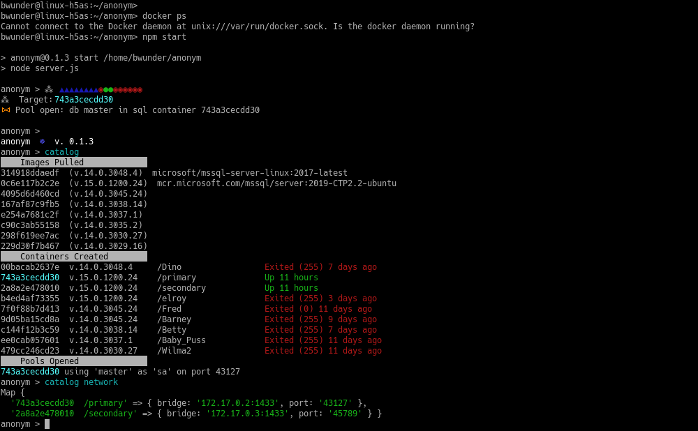

## Autonomous Development and Testing with SQL Server for Linux
Design, construct, reconstruct, simulate or evaluate a network of SQL Server instances.
Six (6) or more SQL Instances - depending on the hardware resources - all running on one
Linux host using Docker Containers and each listening for network query requests on their
own IP at port 1433.

Licensing and Scalability not withstanding, architectural form and function can be accurately
reproduced with little brain smoke through the well known magic of SQL Server backup/restore,
TSQL scripts and human intelligence. And it all can be easily done today using the Node.js
event loop, the "Official" SQL Server for Linux Docker Images Developer Edition with a couple
of Docker Volumes to facilitate backups/restore and OpenSSL for self-signed TLS security.

Given an ability to properly describe the live environment even SQL Server patch and update
regression evaluations can be quick and easy with low internal resource requirements using
containers. It helps that any collection of SQL Server 2017 versions and/or products (PIDs)
can run side-by-side. Every database backend needed can be on the host for continuity of
productivity when disconnected - not to mention amazingly light performance impact on the host
while everything runs in the background.

Training Databases can might be hosted on a Trainer's laptop. Other collaborations are surely
enabled. All you need are database backups or delimited data files and the TSQL database scripts
that might be necessary for configuration and data obfuscation when necessary.

## Installation

### Install Docker, Node.js, OpenSSL and mssql_tools from package or source

It is recommended that the primary package repo and the CLI package manager for your Linux
OS. e.g., apt-get, rpm, yast, yum, zypper, etc. else local compile from source is used to
complete this step. It may, in some cases, be necessary to get the mssql_tools (was ODBC)
tools from Microsoft's repo. See the Microsoft SQL Server for Linux on-line documentation
for mssql_tools download and installation details.

### Define two docker volumes

Allow Docker to choose the location. Using other paths can result in unexpected access problems
inside the container. This default location also places root access requirements from the host.
These volumes are present in each SQL Server container sqlpal creates as subfolders of '/var/opt/mssql'.

    > docker volume create private
    > docker volume create sqlBackups

### Prepare the application folder

While knowledge of local root credentials is required for full app functionality, running
the Node.js CLI app from a folder location in the current user's $HOME is strongly recommended.
With this practice, multiple people can run a personal app instance and all can use the same
containers as necessary with each having a personal activity history much like *$HOME/.bash_history*
except stored in the client's document database providing far better query & search support.

    > mkdir sqlpal
    > cd sqlpal

Review then clone or copy-paste the project source to this folder from the github repo.

    > https://www.github.com/bwunder/sqlpal

### Define queries available to the runtime by editing the queries.js module file.

In general, shorter queries that need no modification and expect no parameters are
best suited for embedding as template strings, however, the user is always free to decide what
belongs in queries and what should be a script (we add those below).

Copy and paste any TSQL queries desired and enclose with template string delimiters (`back-ticks`).
Queries are upserted into the 'templates.db' nedb database at each application start-up: all
additions, changes and deletions applied since the last start-up are reported in the log.

Queries can added, edited or removed at any time using the sqlpal CLI. Changes take effect immediately
in sqlpal beginning with the next query after the query is saved.

### Copy or move the user's TSQL Scripts into the scripts subfolder.

Individual query expressions are nicely for inclusion in templates.db. Scripts with more than one
query are probably better stored as script files. Scripts can be added, changed or removed from the
folder at any time like any other file or from the sqlpal CLI (**script <file-name> --edit**). Changes
take effect immediately beginning with the next script execution after the save.

Only Scripts using the *.sql* extension are recognized by the **script** command.

### Review and edit the config.json file as required

Settings in config.json, other than perhaps passwords, will usually get you started with no changes.
Many are simply the defaults used when a setting is not explicitly set.

Configuration changes can be made at any time and are applied at the next runtime reference - if
that happens - else at the next application start-up as config.json is imported anew.

See
[sqlpad config documentation](https://github.com/rickbergfalk/sqlpad/blob/master/server/lib/config/configItems.js)
for details on sqlpad configuration. Note that we are using sqlpad as a dependent process. It is
not necessary to also install a global instance. You can if wish, however the global instance
will not use any configuration values from sqlpal's config.json.
