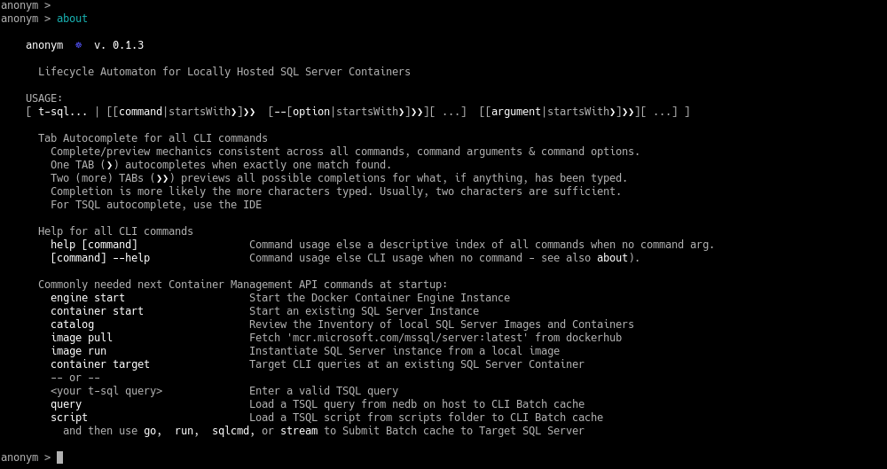

# Anonym 
### Lifecycle Automaton for Locally Hosted SQL Server Containers

    Create, configure and restore data into a collection of running SQL Servers 
        ...each in its dedicated Docker Container
            ...Docker API, SQLPad HTTPS and SQL Server TDS exposed under a TLS shroud
                ...Contained on a single Linux compute instance 

    And then do it again and again, over and over, exactly the same every time, on each and every developer and tester's stand alone compute instance.

    Oh, and it has to be easy for everybody to get it right every time. 
    
    System as a unit
        Database images, clones from any modern data milieu taken from live SQL Servers else TSQL scripts of the physical database model are applied to containers built from "official" images from https://hub.docker.com (dockerhub). Other relational databases, document stores, graphs and key stores may be included along side the SQL Servers. Applications too, on a virtual private ethernet simulation of the cloned network(s) or use the Docker CLI to join the Docker Container Engine and database instances to the connected network(s) of the host.    

    Make and maintain any laptop as a conformed and universal DEV/TEST appliance. Distribute to the team as dockerfiles buit upon images from [dockerhub](https://hub.docker.com).
    Validate changes as is consistent with the organization defined Software Lifecycle Practices and accept them into the mainline as dockerfile layers. Team members can all use the same environment definitions and descriptors as are used in the live system without stepping on one another. All can apply change layers as they are validated and accepted by team leaders. And all can rebase their anonym to current state at any time.     
    
    Many valid non-production* scenarios: Availability Groups, Clouds, Clusters, Farms, Federations, Graphs, Networks

    Emulate any complex distributed SQL data resource (it) on one compute instance: 
            ⏺  Architects can mock it up   
            ⏺  Developers can make it work  
            ⏺  Data Analysts can slice and dice it
            ⏺  Data Miners can dig and delve it
            ⏺  Engineers can measure it
            ⏺  Forcasters can dig it
            ⏺  Prognosticators can guess at it
            ⏺  Procrastinators can hurry up and wait for it
            ⏺  Remote Workers can do anything an in-office person can do with it
            ⏺  Testers can recreate states on it
            ⏺  Trainers can provide clean student workspaces from it  
            ⏺  Intruders that can tap into it still have to decipher it  

Actual Data used can db file copies: for attachment, db backup: for restore, flat files: for import, 
Docker Images: ready to start as appropriate to the circumstances and dockerfile layers for use in the development iteration context. The application exposes shared Docker Volume bindings to all SQL Server containers instantiated. These Volumes enable direct attached, system bus (USB) or network sources to get data in or out from under the anonym's shroud. Once populated, all resources needed to do the work are local to the compute Instance. And, after the work is completed, the compute instance is easily sequestered, archive, backed up and/or repurposed as appropriate.  

*Non-production use appropriate the the SQL Server "Development" PID is presumed. For uses that might not fall under "Developer"  licence model please 

## Installation

### Prerequisites
#### 64-bit Linux compute instance able to host the Docker CE Container Engine.
#### When slightly loaded, a dozen or more SQL containers may be usable on budget commodity hardware. 

    * Docker version 17 or later 
    * Node.js version 8 or later    
    * OpenSSL version 1.1l or later
    * An IDE for Linux that parses javascript and TSQL (i.e., atom, bluefish, code, etc.)

    Docker, node and OpenSSL are available through the main command-line package managers of most Linux 
    Distro's and may already be installed. The Docker daemon may already be up and running?  

### nice-to-haves 

    * RAM
    * text editor able to read-write app buffers - vi is always there, EMACs is much nicer
    * mssql_tools (The anonym relies on the sqlcmd included in the official SQL Server Container)

### Installation/Initialization 

    at the bash prompt  
        mkdir anonym
        cd anonym
        npm install anonym
        npm start

#### Initialize the CLI query store 

    Import (upsert) the queries from the queries.js file module into the CLI's query store. (Edit the file 
    at any time and repeat this import to upsert your changes into the store.)
        query import

### Copy your TSQL Scripts into the scripts subfolder for use on any Contained SQL Instance.

    Individual query expressions of a few lines are better included in the query store. Scripts with more 
    than one query, join complexity or batch seperators are good candidates for script files. Scripts can 
    be added, changed or removed from the folder at any time like any other file and edited using the CLI
    linked IDE from the prompt 
        script <scipt-name> edit 
    or from the file system with other text editors. Changes are in effect when saved.
 
    Only Scripts using the '.sql' extension will be recognized by the script command. 

#### Review and edit the config.json and sqlpad.json files as needed

        anonym > settings config
        anonym > settings --environment
        anonym > settings --mssqlconf
        anonym > settings 

    App Settings are found in config.json - The config object includes the dockerhub repo name, new
    container defaults, runtime defaults and host paths use by the CLI, the Docker API, new SQL 
    Containers, query connection pragma (SET), a variety of mssql.Request presets (i.e., .query, .batch, 
    .stream) as well as SQLCMD command-line switch defaults to use. Changes to the config file, as is also 
    true for TLS credentials as detailed below, changes can be made at any time and are applied at the 
    next reference in the runtime - if that happens, at the next application start-up if the reference is 
    in the bootstrap.

If unfamiliar with SQLPad, check out [SQLPad](https://rickbergfalk.github.io/sqlpad/)
and see this [SQLPad module source file](https://github.com/rickbergfalk/sqlpad/blob/master/server/lib/config/configItems.js)
for details on all SQLPad settings. 

mssqlconf is exposed in an option of the CLI's <b>settings</b> command

### Run the CLI

        $ npm update
        $ npm start

    Work interactively in bash on any running SQL Server container     

### Include the [test CLI-command extension](./docs/test.md) extention (optional) 

    Adds the test command Vorpal extention module to the CLI from ../lib/tests.js. Commands in this module execute commands synchronously in javascript Promise chains we can rightly consider as recipes.  Users may define and execute automation recipes for the automaton in the 'tests.js' file. Resistance to editing core atomaton modules until a revision is properly emulated through the test module is encouraged. <blockquote>test [torial]</blockquote> only rollbacks are nearly pain free. 

        $ npm start test

#### [TLS](./docs/tls.md)

    Host self-signed TLS is available, configurable and applicable for the Docker Remote API, SQLPad's Express http server and SQL Server connection pools featuring Almost Perfect Forward Secrecy, eg. new certificate at each app start (<code>&lt npm start</code>) and new CA on demand     
